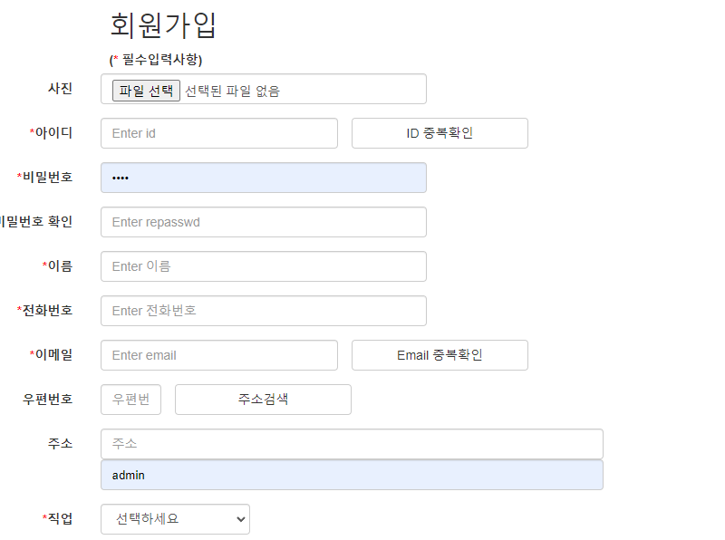

# Spring Boot 기반 쇼핑몰 프로젝트

> # 쇼핑몰 프로젝트 기능

- 회원가입 

  

  

- 

- 로그인 /로그아웃

  

  

- 상풍등록/상품 목록 /상품 수정

- 챗 봇

- 마이페이지

- 회원 목록

- 상품 상세 페이지

> # 프로젝트 기능흐름도
>
> 

> # 추가적으로 구현할 기능

- 장바구니
- 주문하기
- 리뷰
- Q&A
